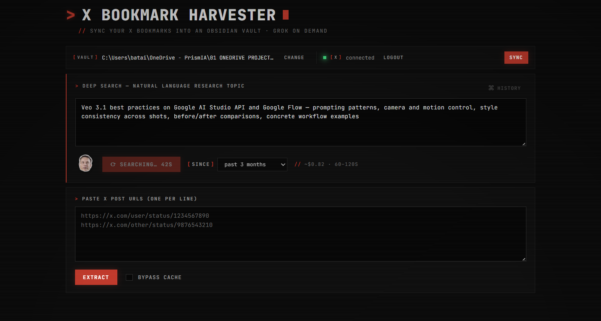

# X Bookmark Harvester

Turn your X (Twitter) bookmarks into a searchable, structured [Obsidian](https://obsidian.md/) vault. Sync the list from your account, harvest post content + comments + media via the X API, optionally enrich each bookmark with Grok insights, then query and maintain the whole library through Claude Code skills.

Local-first, single-user, your data never leaves your machine.



## Features

- **Deep Search** — type a natural-language research topic, Deep Search decomposes it into 6 sub-queries, runs them in parallel against Grok's `x_search` tool, **validates every returned tweet ID via the X API bulk-lookup endpoint** (drops hallucinations), applies an optional time-range filter (past week → past year), mechanically scores, then reranks via a final Grok aggregation call. Expect **20-30 verified candidates** (not the 50 raw that Grok alone returns — hallucinations are filtered out). Candidates are displayed with a preview + checkbox list, stats show how many were dropped as fake, and selected URLs flow into the normal extraction pipeline. Results are cached for 2h and browsable from a history drawer.
- **Sync your X bookmarks** from `GET /users/:id/bookmarks` with OAuth 2.0 PKCE — dedups against what's already in the vault, processes only the new ones.
- **Manual paste mode** — drop any list of X post URLs and extract them in batch.
- **Rich extraction** — full post text (including long-form and threads), author, date, metrics, media, top comments sorted by likes.
- **Grok enrichment on demand** — per-bookmark synthesis: author additions, notable links from comments, community sentiment, key replies.
- **Native vault location picker** — choose any folder on your machine through a system file dialog (PowerShell on Windows, osascript on macOS, zenity on Linux).
- **Cache + re-render** — every fetch is persisted to `.raw/<id>.json`. You can re-render a note without re-calling the API, useful when you tweak the markdown template.
- **Eight Claude Code skills** (`/bookmark-deepsearch`, `/bookmark-status`, `/bookmark-enrich`, `/bookmark-tags`, `/bookmark-graph`, `/bookmark-query`, `/bookmark-digest`) for maintaining the library without leaving Claude Code.

## Quick start

```bash
# 1. Clone and install
git clone https://github.com/francoisbat30/x-bookmark-harvester.git
cd x-bookmark-harvester
npm install

# 2. Configure credentials
cp .env.example .env.local
# Edit .env.local — see "Credentials" below

# 3. Run
npm run dev
# open http://127.0.0.1:3000
```

Click **Connect X account**, authorize, then either press **Sync my bookmarks** or paste URLs manually.

## Credentials

You need two things in `.env.local`:

| Key | How to get it |
|---|---|
| `X_API_BEARER_TOKEN` | [developer.x.com](https://developer.x.com) → your app → Keys and tokens → Bearer Token |
| `X_OAUTH2_CLIENT_ID` + `X_OAUTH2_CLIENT_SECRET` | Same app → User authentication settings → enable OAuth 2.0, Confidential client. Set redirect URI to `http://127.0.0.1:3000/callback` (X does not accept `localhost`). Then Keys and tokens → OAuth 2.0 Client ID and Secret. |
| `XAI_API_KEY` (optional) | [console.x.ai](https://console.x.ai) — only needed for the Grok enrich and Grok-fallback extraction buttons |

## Vault location

The vault folder is where your `.md` notes are written. It can be set three ways, in order of precedence:

1. **The UI Settings panel** — click "Change…" in the Vault location card, then "Browse…". Your choice persists to `%APPDATA%/x-bookmark-harvester/config.json` (Windows) / `~/Library/Application Support/` (macOS) / `~/.config/` (Linux).
2. **Environment variable** — `OBSIDIAN_VAULT_PATH` + `OBSIDIAN_BOOKMARKS_SUBFOLDER` in `.env.local`.
3. **Default** — `./vault/x-bookmarks` inside the project, useful for trying the app out.

Your OAuth tokens (`auth.json`) and user config (`config.json`) are deliberately stored **outside** the vault, in the OS-specific per-user data directory, so that cloud-syncing your vault (OneDrive, iCloud, Dropbox) can't leak credentials.

## Security notes

- The dev server **only binds to 127.0.0.1** (see `package.json`). It is not reachable from other machines on your network, and it is not hardened for multi-tenant use. Do not expose it via a tunnel, reverse proxy, or `--hostname 0.0.0.0` unless you add your own authentication layer — anyone who can reach the port can consume your X API quota and change your vault location.
- **OAuth refresh tokens are stored in plaintext** on your user data directory (`%APPDATA%` / `~/Library/Application Support` / `~/.config`). They are not inside the vault on purpose (see `docs/x-integration.md`), but any process running as your OS user can read them. A compromised account = compromised tokens.
- Image downloads are **restricted to a host allowlist** (`pbs.twimg.com`, `video.twimg.com`, `abs.twimg.com`, `ton.twimg.com`) with a 20 MB cap to prevent SSRF via crafted tweet content and DoS via oversized responses.
- Note writes are **guarded against path traversal**: filenames that resolve outside the vault directory throw rather than writing.
- State-changing API routes (`/api/auth/x/logout`, `/api/bookmarks/list`) reject cross-origin requests via `sec-fetch-site` / `Origin` checks.
- Report vulnerabilities by opening a GitHub issue.

## Documentation

Architecture and design docs for developers:

- [`docs/architecture.md`](./docs/architecture.md) — overall shape, namespaces, data flow
- [`docs/x-integration.md`](./docs/x-integration.md) — X API v2, OAuth 2.0 PKCE, Grok usage
- [`docs/obsidian-integration.md`](./docs/obsidian-integration.md) — vault layout, cache envelope, markdown rendering, collisions
- [`docs/skills.md`](./docs/skills.md) — how the Claude Code skills work end-to-end
- [`PRD-x-bookmark-harvester.md`](./PRD-x-bookmark-harvester.md) — product requirements

## Project layout

```
app/                Next.js app router — pages, components, server actions, API routes
lib/
  x/                X API + OAuth + Grok (xAI) integration
  obsidian/         Vault paths, cache envelope, markdown rendering, media downloads
  types.ts          Shared DTOs
  user-config.ts    Per-user vault settings persisted in %APPDATA%
  platform.ts       OS-specific per-user data dir resolution
scripts/
  skills/           CLI entry points for the Claude Code skills (deterministic fs ops)
  render.ts         Re-render a note from its cache without hitting the API
  spike-*.ts        Standalone exploration scripts
tests/              Vitest unit tests
.claude/skills/     Slash command definitions (SKILL.md per skill)
docs/               Architecture + integration docs
```

## Development

```bash
npm run dev         # Next.js dev server at 127.0.0.1:3000
npm test            # Run the test suite (vitest)
npm run test:watch  # Watch mode
npm run build       # Production build
npx tsc --noEmit    # Type-check only
```

Skill CLIs can be invoked directly without the Claude Code front-end:

```bash
npm run skill:status              # dashboard
npm run skill:tags -- audit       # find duplicate tags
npm run skill:graph -- apply      # push color groups to Obsidian
npm run skill:filter -- --tags=mlx,local-inference
npm run skill:deepsearch -- "seedance 2.0 capcut prompting"
```

## License

MIT. See [LICENSE](./LICENSE).
